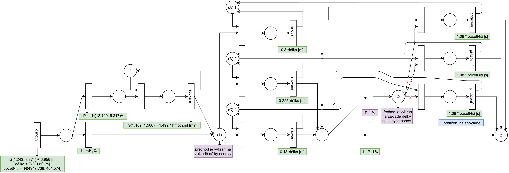
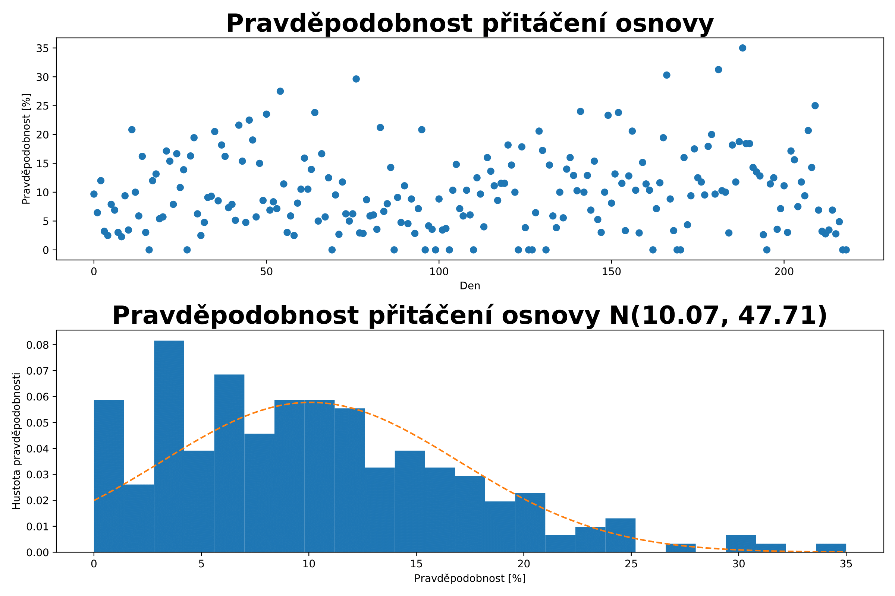

# Fabric production simulation
The program aims to analyze, model and simulate production pipeline of the Czech textile company that wished to remain anonymous.
Found possible improvements for higher production rate in the future. Sensitive data were removed from the project. 


*<div align="center"> Part of the modeled production pipeline.</div>*


*<div align="center"> Likelihood of turning of the model.</div>*

## Authors
1. Rozsíval Michal [xrozsi06]
2. Alexander Polox [xpolok03]  

## Usage
1. Init the project and compile source codes.
```bash
make
```
Alternatively other experiments could be created with.
```bash
make max
make nonstop
```
`Max` simulates fully utilized production line.

`Nonstop` simulates experiment with warps generation loop without pauses.

2. Run experiments
```
./model [X U=D/W/M/Y]
```
where X is count and U is type of time interval.
For example 10 year simulation could be run in following way:
```
./model 10 Y
```

3. Cleanup
```bash
make clean
```
